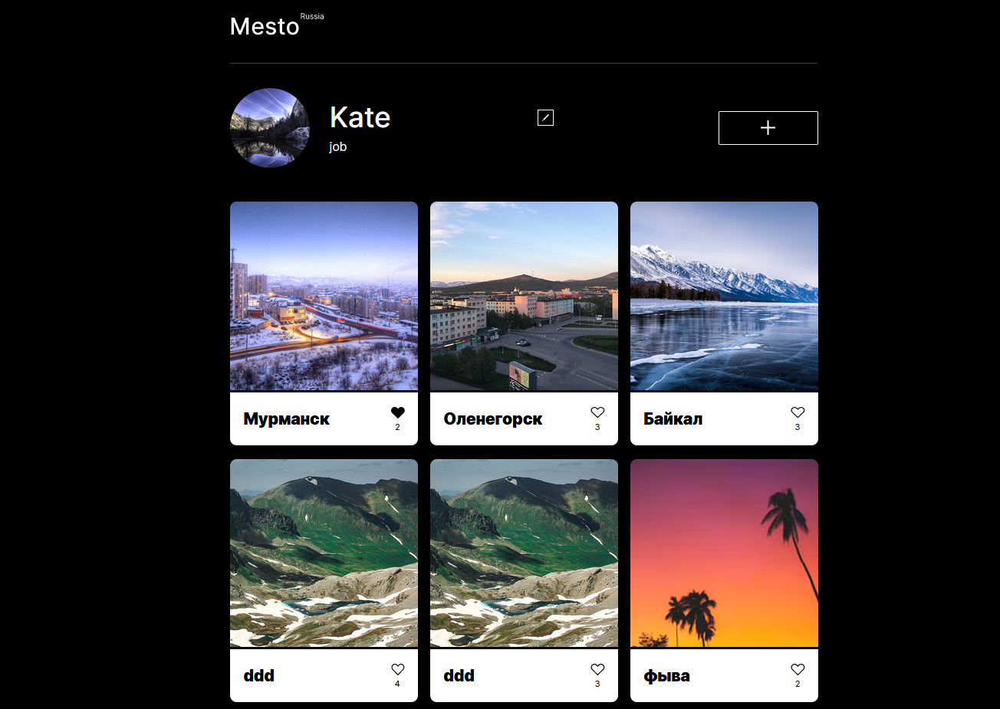

# Mesto
 **Mesto**  - это интерактивная страница, куда можно добавлять фотографии, удалять их и ставить лайки. <br>
---
## Обзор проекта

<details><summary>DEMO Mesto</summary>

  
</details>

 Ссылка на макет [Figma](https://www.figma.com/design/kRVLKwYG3d1HGLvh7JFWRT/JavaScript.-Sprint-6?node-id=0-1&t=zztrAQxg3velV0hm-0).

---
## Было сделано:
1. Разработана валидация форм:
  - Валидация формы «Редактировать профиль»:
    - Оба поля обязательные.
    - В поле «Имя» должно быть от 2 до 40 символов.
    - В поле «О себе» должно быть от 2 до 200 символов.
    - Оба поля могут содержать только латинские и кириллические буквы, знаки дефиса и пробелы.
  - Валидация формы «Новое место»:
    - Оба поля обязательные.
    - В поле «Название» должно быть от 2 до 30 символов.
    - В поле «Ссылка на картинку» должен быть URL.
    - Поле «Название» может содержать латинские и кириллические буквы, знаки дефиса и пробелы.
    - В поле «Ссылка на картинку» должен быть URL. 
2. Интеграция c API:
  - Загрузка информации о пользователе с сервера.
  - Загрузка карточек с сервера.
  - Редактирование профиля.
  - Добавление новой карточки.
  - Отображение количества лайков карточки.
  - Удаление карточки, через попап удаления карточки.
  - Постановка и снятие лайка.
  - Обновление аватара пользователя.
  - Улучшен UX всех форм, добавлено уведомление «Сохранение...», пока данные загружаются с сервера.
3. Деплой на GitHub Pages [ссылка](https://oioeniks.github.io/mesto-project-ff/).
---
## Стек
HTML, CSS, Webpack

---
## Установка и запуск
### `Требования`
Для установки и запуска проекта, необходим NodeJS v8+.
### `Установка зависимостей`
Для установки зависимостей, выполните команду:
```
$ npm i
```
### `Запуск Development сервера`
Чтобы запустить сервер для разработки, выполните команду:
```
npm run dev
```
## Другие активные скрипты

Для сборки проекта
```
npm run build
```
Для сборки проекта перед деплоем 
```
npm run predeploy
```
Для деплоя проекта
``` 
npm run deploy
```
